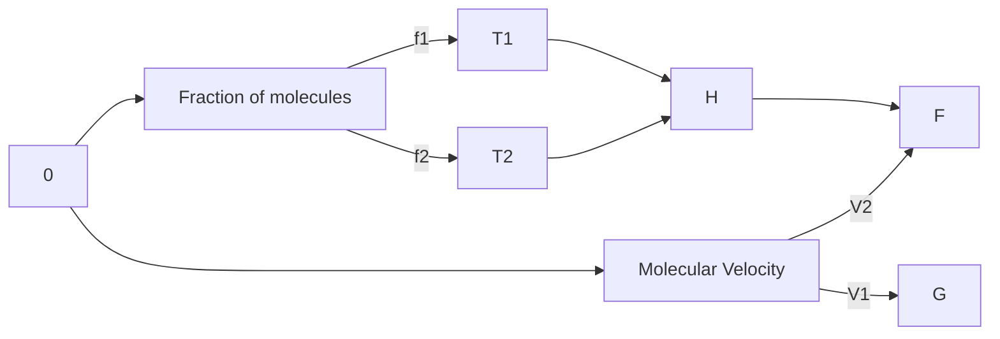

1. The unit cell with crystallographic dimensions, a ≠ b ≠ c, α = γ = 90 and β ≠ 90 is
(1) Triclinic
(2) Monoclinic
(3) Orthorhombic
(4) Tetragonal

2. While charging the lead storage battery, _________.
(1) PbSO₄ on anode is reduced to Pb
(2) PbSO₄ on cathode is reduced to Pb
(3) PbSO₄ on cathode is oxidized to Pb
(4) PbSO₄ on anode is oxidized to PbO₂

3. Adenosine is an example of
(1) Nucleotide
(2) Purine base
(3) Pyrimidine base
(4) Nucleoside

4. Orlon has monomeric unit
(1) Acrolein
(2) Glycol
(3) Vinyl cyanide
(4) Isoprene

5. The two electrons have the following set of quantum numbers :

$$P = 3, 2, -2, +\frac{1}{2}$$

$$Q = 3, 0, 0, +\frac{1}{2}$$

Which of the following statement is true ?
(1) P and Q have same energy
(2) P has greater energy than Q
(3) P has lesser energy than Q
(4) P and Q represent same electron

6. H₂O₂ cannot oxidise

(1) PbS
(2) Na₂SO₃
(3) O₃
(4) KI

7. In the given set of reactions,

2-Bromopropane $\xrightarrow{\text{AgCN}\atop\text{alc./heat}}$ X $\xrightarrow{\text{LiAlH₄}}$ Y

the IUPAC name of product 'Y' is

(1) N-Methylpropanamine
(2) N-Isopropylmethanamine
(3) Butan-2-amine
(4) N-Methylpropan-2-amine

8. On heating with concentrated NaOH solution in an inert atmosphere of CO₂, white phosphorous gives a gas. Which of the following statement is incorrect about the gas?

(1) It is less basic than NH₃.
(2) It is more basic than NH₃.
(3) It is highly poisonous and has smell like rotten fish.
(4) It's solution in water decomposes in the presence of light.

9. Sodium metal crystallizes in B.C.C. lattice with edge length of 4.29 Å. The radius of sodium atom is

(1) 2.857 Å
(2) 1.601 Å
(3) 2.145 Å
(4) 1.857 Å

10. 0.06% (w/v) aqueous solution of urea is isotonic with
(1) 0.06% glucose solution         
(2) 0.6% glucose solution
(3) 0.01 M glucose solution        
(4) 0.1 M glucose solution

11. In a first order reaction, the concentration of the reactant is reduced to 12.5% in one hour. When was it half completed?
(1) 3 hr                           
(2) 20 min
(3) 30 min                         
(4) 15 min

12. The electrolyte having maximum flocculation value for Agl/Ag+ sol. is
(1) NaCl                           
(2) Na₂S
(3) Na₂SO₄                         
(4) Na₃PO₄

13. Copper is extracted from Copper pyrites by heating in a Bessemer converter. The method is based on the principle that
(1) Copper has more affinity for oxygen than Sulphur at high temperature.
(2) Iron has less affinity for oxygen than Sulphur at high temperature.
(3) Copper has less affinity for oxygen than Sulphur at high temperature.
(4) Sulphur has less affinity for oxygen at high temperature.

14. Which of the following will be able to show geometrical isomerism?
(1) MA₂B - Square planar           
(2) MA₂B₂ - Tetrahedral
(3) MABCD - Square planar          
(4) MABCD - Tetrahedral

15. The electronic configuration of Gd²⁺ is (at. no. of Gd is 64)

(1) [Xe] 4f⁸
(2) [Xe] 4f⁷
(3) [Xe] 4f⁷ 5d¹ 6s²
(4) [Xe] 4f⁷ 5d¹

16. MSO₄ → X → Y → Z
↑     ↑     ↑
NH₄OH NH₄OH H₂S
white excess

Here M and Z are

(1) Cu, ZnS
(2) Zn, ZnS
(3) Fe, FeS
(4) Al, Al₂S₃

17. The hydrolysis of optically active 2-bromobutane with aqueous NaOH result in the formation of:

(1) (+) butan-2-ol
(2) (-) butan-2-ol
(3) (±) butan-1-ol
(4) (±) butan-2-ol

18. The distinguishing test between methanoic acid and ethanoic acid is

(1) Litmus test
(2) Tollen's test
(3) Esterification test
(4) Sodium bicarbonate test

19. In H₂ - O₂ fuel cell the reaction occurring at cathode is

(1) 2H₂(g) + O₂(g) → 2H₂O(l)
(2) O₂(g) + 2H₂O(l) + 4e⁻ → 4OH⁻(aq)
(3) H⁺ + e⁻ → ½ H₂
(4) H⁺(aq) + OH⁻(aq) → H₂O(l)

20. Which of the following curve is in accordance with Freundlich adsorption isotherm ?

(1) Graph 1
(2) Graph 2
(3) Graph 3
(4) Graph 4

21. How many ions per molecule are produced in the solution when Mohr salt is dissolved in excess of water ?
(1) 4
(2) 5
(3) 6
(4) 10

22. Glycogen is
(1) a polymer of β-D-glucose units
(2) a structural polysaccharide
(3) structurally very much similar to amylopectin
(4) structurally similar to amylopectin but extensively branched

23. Number of possible alkynes with formula C5H8 is
(1) 2
(2) 3
(3) 4
(4) 5


24. Which of the following aqueous solution has the highest freezing point?
(1) 0.1 M Sucrose
(2) 0.01 M NaCl
(3) 0.1 M NaCl
(4) 0.01 M Na₂SO₄

25. Half life period of a first order reaction is 10 min. Starting with initial concentration 12 M, the rate after 20 min is
(1) 0.0693 M min⁻¹
(2) 0.693 × 3 M min⁻¹
(3) 0.0693 × 3 M min⁻¹
(4) 0.0693 × 4 M min⁻¹

26. The salt which responds to dilute and concentrated H₂SO₄ is
(1) CaF₂
(2) Ba(NO₃)₂
(3) Na₂SO₄
(4) Na₃PO₄

27. On heating potassium permanganate, one of the following compound is not obtained:
(1) O₂
(2) MnO
(3) MnO₂
(4) K₂MnO₄

28. 
```
Br + Mg --dry ether--> A --H₂O, H⁺--> B
```

The product 'B' is

(1) Cyclohexanol

(2) Cyclohexyl magnesium bromide

(3) Cyclohexene

(4) Phenol

29. The formation of cyanohydrin from a ketone is an example of
(1) Nucleophilic substitution
(2) Nucleophilic addition
(3) Electrophilic addition
(4) Electrophilic substitution

30. One of the following is an essential amino acid.
(1) Tyrosine
(2) Cysteine
(3) Isoleucine
(4) Serine

31. The aqueous solution of following salt will have the lowest pH :
(1) NaClO₃
(2) NaClO
(3) NaClO₂
(4) NaClO₄

32. For one of the element various successive ionization enthalpies (in kJ mol⁻¹) are given below :

| I.E. | 1ˢᵗ   | 2ⁿᵈ  | 3ʳᵈ  | 4ᵗʰ    | 5ᵗʰ    |
| ---- | ----- | ---- | ---- | ------ | ------ |
|      | 577.5 | 1810 | 2750 | 11,580 | 14,820 |

The element is
(1) Si
(2) P
(3) Al
(4) Mg

33. 0.30 g of an organic compound containing C, H and Oxygen on combustion yields 0.44 g CO₂ and 0.18 g H₂O. If one mol of compound weighs 60, then molecular formula of the compound is
(1) CH₂O
(2) C₂H₆O
(3) C₄H₆O
(4) C₂H₄O₂


34. One of the following amide will not undergo Hoffmann bromamide reaction:

(1) CH₃CONH₂
(2) CH₃CONHCH₃
(3) C₆H₅CONH₂
(4) CH₃CH₂CONH₂

35. Cheilosis and digestive disorders are due to the deficiency of

(1) Thiamine                
(2) Ascorbic acid
(3) Riboflavin              
(4) Pyridoxine

36. How many Coulombs of electricity are required for the oxidation of one mol of water to dioxygen?

(1) 9.65 × 10⁴ C            
(2) 1.93 × 10⁴ C
(3) 1.93 × 10⁵ C            
(4) 19.3 × 10⁵ C

37. 100 cm³ of 1 M CH₃COOH was mixed with 100 cm³ of 2 M CH₃OH to form an ester. The change in the initial rate if each solution is diluted with equal volume of water would be

(1) 2 times                 
(2) 4 times
(3) 0.5 times               
(4) 0.25 times


38. Which of the following colloids cannot be easily coagulated ?
(1) Lyophobic colloids
(2) Multimolecular colloids
(3) Macromolecular colloids
(4) Irreversible colloids

39. The complex ion having minimum magnitude of Δ₀(CFSE) is
(1) [Cr(CN)₆]³⁻
(2) [Co(NH₃)₆]³⁺
(3) [Co(CN)₆]³⁻
(4) [Cr(H₂O)₆]³⁺

40. The arrangement of following compounds :
i. bromomethane
ii. bromoform
iii. chloromethane
iv. dibromomethane

In the increasing order of their boiling point is
(1) iii < i < iv < ii
(2) iv < iii < i < ii
(3) ii < iii < i < iv
(4) i < ii < iii < iv

41. Iodoform can be prepared from all, except
(1) propan-2-ol
(2) butan-2-one
(3) propan-1-ol
(4) acetophenone

42. Identify 'Q' in the following sequence of reactions:
```
COCH₃
|
PCl₅   NaNH₂
→P -----→ Q
excess
```
(1) Chemical structure 1

(2) Chemical structure 2

(3) Chemical structure 3

(4) Chemical structure 4


43. Cryolite is

(1) Na₃AlF₆ and is used in the electrolysis of alumina for decreasing electrical conductivity.

(2) Na₃AlF₆ and is used in the electrolysis of alumina for lowering the melting point of alumina only.

(3) Na₃AlF₆ and is used in the electrolysis of alumina for lowering the melting point and increasing the conductivity of alumina.

(4) Na₃AlF₆ and is used in the electrolytic refining of alumina.

44. Which of the following compound of Xenon has pyramidal geometry?

(1) XeOF₄
(2) XeF₂
(3) XeO₃
(4) XeF₄

45. After adding non-volatile solute freezing point of water decreases to -0.186 °C. Calculate ΔTb if Kf = 1.86 K kg mol⁻¹ and Kb = 0.521 K kg mol⁻¹

(1) 0.521
(2) 0.0521
(3) 1.86
(4) 0.0186

46. Plot of Maxwell's distribution of velocities is given below:



Which of the following is correct about this plot?

(1) T₁ < T₂
(2) f₁ > f₂
(3) T₁ > T₂
(4) V₁ < V₂

47. The pair of compound which cannot exist together in solution is

(1) NaHCO₃ and NaOH
(2) NaHCO₃ and H₂O
(3) NaHCO₃ and Na₂CO₃
(4) Na₂CO₃ and NaOH

48. What amount of dioxygen (in gram) contains 1.8 × 10²² molecules?

(1) 0.0960
(2) 0.960
(3) 9.60
(4) 96.0

49. Using MOT, compare O₂⁺ and O₂ species and choose the incorrect option.

(1) O₂⁺ have higher bond order than O₂.
(2) O₂⁺ is less stable.
(3) O₂⁺ is diamagnetic while O₂ is paramagnetic.
(4) Both O₂⁺ and O₂ are paramagnetic.

50. Which of the following is not true ?

(1) Erythromycin is a bacteriostatic antibiotic.
(2) Ampicillin is not a natural antibiotic.
(3) Prontosil is not converted into sulphanilamide in the body.
(4) Vancomycin is a broad spectrum antibiotic.

51. In the reaction

$$S + \frac{3}{2}O_2 \longrightarrow SO_3 + 2x \text{ kJ and } SO_2 + \frac{1}{2}O_2 \longrightarrow SO_3 + y \text{kJ}$$

heat of formation of SO₂ is

(1) x + y
(2) x - y
(3) 2x - y
(4) 2x + y

52. Arrange the following compounds in the increasing order of their acidic strength :

i. m-nitrophenol
ii. m-cresol
iii. phenol
iv. m-chlorophenol

(1) iii < ii < i < iv
(2) ii < iv < iii < i
(3) ii < iii < iv < i
(4) ii < iii < i < iv


53. In the sequence of following reactions :
```
(1) Br₂
P ---------> Q
(2) Sn/HCl

(1) NaNO₂/HCl
273 - 278 K
(2) H₂O/H₃PO₂
-------------> R
KMnO₄
------>
OH
```

```
COOH
|
Br
```

the starting compound 'P' is

(1) o-nitro toluene
(2) m-nitro toluene
(3) o-bromo toluene
(4) p-nitro toluene

54. Acetic acid is treated with Ca(OH)₂ and the product so obtained is subjected to dry distillation. The final product is

(1) ethanal
(2) propanal
(3) propanone
(4) ethanol

55. The correct statement is

(1) BF₃ is the strongest Lewis acid among the other boron halides.
(2) BI₃ is the weakest Lewis acid among the boron halides.
(3) There is maximum pπ - pπ back bonding in BF₃.
(4) There is minimum pπ - pπ back bonding in BF₃.

56. Which of the following compound possesses the "C - H" bond with the lowest bond dissociation energy ?

(1) Toluene
(2) Benzene
(3) n-pentane
(4) 2, 2-dimethyl propane

57. In presence of HCl, H₂S results the precipitation of Group-2 elements but not Gp-4 elements during qualitative analysis. It is due to

(1) higher concentration of S²⁻    
(2) higher concentration of H⁺
(3) lower concentration of S²⁻     
(4) lower concentration of H⁺

58. One of the following conversion results in the change of hybridization and geometry :

(1) CH₄ to C₂H₆                   
(2) NH₃ to NH₄
(3) BF₃ to BF₄                     
(4) H₂O to H₃O⁺

59. Water softening by Clark's process uses

(1) CaHCO₃                         
(2) NaHCO₃
(3) Na₂CO₃                         
(4) Ca(OH)₂

60. An alkali metal hydride (NaH) reacts with diborane in 'A' to give a tetrahedral compound 'B' which is extensively used as reducing agent in organic synthesis. The compounds 'A' and 'B' respectively are

(1) C₂H₆ and C₂H₅Na                
(2) CH₃COCH₃ and B₂N₃H₆
(3) C₆H₆ and NaBH₄                 
(4) (C₂H₅)₂O and NaBH₄
