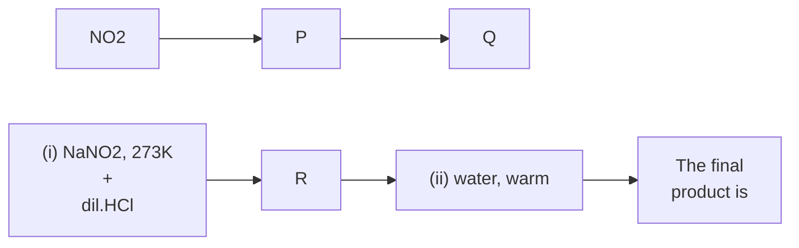

1. Copper is extracted from copper pyrites by
(1) Thermal decomposition
(2) Reduction by coke
(3) Electrometallurgy
(4) Auto reduction


2. Function of potassium ethyl xanthate in froth floatation process is to make the ore
(1) Lighter 
(2) Hydrophobic
(3) Hydrophilic 
(4) Heavier

3. Sulphide ore on roasting gives a gas X. X reacts
with Cl₂ in the presence of activated charcoal
to give Y. Y is:
(1) SO₂Cl₂ 
(2) S₂Cl₂ 
(3) SCl₆ 
(4) SOCl₂


4. Aqueous solution of a salt (A) forms a dense
white precipitate with BaCl₂ solution. The
precipitate dissolves in dilute HCl to produce a
gas (B) which decolourises acidified KMnO₄
solution
A and B respectively are:
(1) BaSO₃, SO₂ 
(2) BaSO₄, H₂S
(3) BaSO₃, H₂S 
(4) BaSO₄,SO₂


5. Bond angle in PH₄⁺ is more than that of PH₃.
This is because
(1) Lone pair – bond pair repulsion exists in PH₃
(2) PH₄⁺ has square planar structure
(3) PH₃ has planar trigonal structure
(4) Hybridisation of P changes when PH₃ is converted to PH₄⁺


6. Incorrectly matched pair is:
(1) XeO₃ – pyramidal
(2) XeF₄ – tetrahedral
(3) XeF₆ – distorted octahedral
(4) XeOF₄ – square pyramidal


7. Phosphorus pentachloride
(1) On hydrolysis gives an oxo acid of phosphorus which is tribasic
(2) On hydrolysis gives an oxo acid of phosphorus which is a good reducing agent
(3) Has all the five equivalent bonds
(4) Exists as an ionic solid in which cation has octahedral structure and anion has tetrahedral structure


8. Identify the set of paramagnetic ions among the following:
(1) V²⁺,Co²⁺,Ti⁴⁺ 
(2) Ni²⁺,Cu²⁺,Zn²⁺
(3) Ti³⁺,Cu²⁺,Mn³⁺ 
(4) Sc³⁺,Ti³⁺,V³⁺


9. How many moles of acidified K₂Cr₂O₇ is required to liberate 6 moles of I₂ from an aqueous solution of I⁻?
(1) 2 
(2) 1 
(3) 0.25 
(4) 0.5


10. Cu₂Cl₂ and CuCl₂ in aqueous medium
(1) CuCl₂ is more stable than Cu₂Cl₂
(2) Stability of Cu₂Cl₂ is equal to stability of CuCl₂
(3) Both are unstable
(4) Cu₂Cl₂ is more stable than CuCl₂


11. The Co-ordination number of Fe and Co in the complex ions, [Fe(C₂O₄)₃]³⁻ and [Co(SCN)₄]²⁻ are respectively:
(1) 3 and 4 
(2) 6 and 8
(3) 4 and 6 
(4) 6 and 4


12. Number of stereoisomers exhibited by [Co(en)₂Cl₂]⁺ is
(1) 4 
(2) 2 
(3) 5 \
(4) 3

13. Give the IUPAC name of [Pt(NH₃)₄][PtCl₄] is

(1) Tetra ammine platinum (o) tetra chlorido platinum (IV)
(2) Tetra ammine palatinate (II) tetra chlorido platinum (II)
(3) Tetra ammine palatinate (o) tetra chlorido platinum (IV)
(4) Tetra ammine platinum (II) tetra chlorido palatinate (II)

(1) Both R and S
(2) Both P and R
(3) Both Q and S
(4) Both P and Q

14. Prolonged exposure of chloroform in humans may cause damage to liver. It is due to the formation of the following compound
(1) CCl₄ 
(2) COCl₂ 
(3) CH₂Cl₂ 
(4) Cl₂


15. Which of the following halide shows highest reactivity towards SN1 reaction?
(1) C₆H₅CH₂Cl
(2) CH₃ - CH₂Cl
(3) CH₃ - CH₂ - CH₂ - CH₂I
(4) C₆H₅Cl


16. In the reaction

```           
              Dry ether
MgBr+CH₃NH₂  ----------->    X
            
```

The number of possible isomers for the organic compound X is
(1) 4 
(2) 5 
(3) 3 
(4) 2

17. Which of the following on heating gives an ether as major products?
(1) C₆H₅CH₂Br + CH₃ONa
(2) C₆H₅ONa + CH₃Br
(3) (CH₃)₃C - Cl + CH₃ONa
(4) C₆H₅CH = CHCl + CH₃ONa

18. The steps involved in the conversion of propan -2-ol to propan -1-ol are in the order
(1) Dehydration, addition of HBr, heating with aq. KOH
(2) Heating with PCl₅, heating with alc. KOH, acid catalysed addition of water
(3) Heating with PCl₅, heating with alc. KOH, hydroboration oxidation
(4) Dehydration, addition of HBr in presence of peroxide, heating with alc. KOH


19. Which of the following is the strongest base?
(1) CH₃COO⁻ 
(2) Cl⁻
(3) OH⁻ 
(4) CH₃O⁻


20.


The product 'P' is

(1)
| 
CHO
|

(2)
CH₂CHO
|
CH=CH-CH₃
|

(3)
| 
CH=CHCHO
|

(4)
|
CHO
|
CH₂CHO
|


21. Which of the following has the lowest boiling point?
(1) CH₃CH₂OH
(2) CH₃ - CH₂ - NH₂
(3) CH₃ - O - CH₃
(4) HCOOH

22. The carbonyl compound that does not undergo aldol condensation is
(1) Acetone
(2) Di chloro acetaldehyde
(3) Tri chloro acetaldehyde
(4) Acetaldehyde


23. 


The final product is:

```
NO2 Br
| |
(1) (2)
\ /
Br OH
| |
(3) (4)
/ \ |
N2Cl Br
```


24. Hinsberg's reagent is
(1) (CH₃CO)₂O / pyridine
(2) C₆H₅SO₂Cl
(3) C₆H₅SO₂NH₂
(4) CH₃COCl / pyridine


25. Which one of the following vitamins is not stored in adipose tissue?
(1) A
(2) B₆
(3) D
(4) E


26. Hypothyroidism is caused by the deficiency of
(1) Vitamin B-12
(2) Adrenalin
(3) Thyroxine
(4) Glucocorticoid


27. C₁-C₄ glycosidic bond is NOT found in
(1) Maltose
(2) Sucrose
(3) Lactose
(4) Starch


28. Which of the following polymer has strongest intermolecular forces of attraction?
(1) Neoprene
(2) Terylene
(3) Polythene
(4) Polystyrene


29. Which of the following monomers can undergo condensation polymerization?
(1) Styrene
(2) Glycine
(3) Isoprene
(4) Propene


30. A food additive that acts as an antioxidant is
(1) BHA
(2) Saccharin
(3) Sugar syrup
(4) Salt


31. Which of the following is not related to drug-enzyme interaction?
(1) Allosteric site
(2) Antagonist
(3) Co-enzymes
(4) Enzyme inhibitor


32. 0.4 g of dihydrogen is made to react with 7.4 g of dichlorine to form hydrogen chloride. The volume of hydrogen formed at 273K and 1 bar pressure is
(1) 9.08L
(2) 4.54L
(3) 90.8L
(4) 45.4L


33. With regard to photoelectric effect, identify the correct statement among the following
(1) Energy of e⁻ ejected increases with the increase in the intensity of incident light
(2) Number of e⁻ ejected increases with the increase in the frequency of incident light
(3) Number of e⁻ ejected increases with the increase in work function
(4) Number of e⁻ ejected increases with the increase in the intensity of incident light


34. The last element of the p-block in 6th period is represented by the outer most electronic configuration
(1) 7s² 7p⁶
(2) 5f¹⁴6d¹⁰7s²7p⁵
(3) 4f¹⁴5d¹⁰6s²6p⁴
(4) 4f¹⁴5d¹⁰6s²6p⁶


35. The conjugate base of NH₃ is
(1) NH₄⁺ 
(2) NH₄OH 
(3) NH₂OH 
(4) NH₂⁻


36. A gas mixture contains 25% He and 75% CH₄ by volume at a given temperature and pressure. The percentage by mass of methane in the mixture is approximately____
(1) 75% 
(2) 25% 
(3) 92% 
(4) 8%


37. The percentage of s-character in the hybrid orbitals of nitrogen in NO₂⁺, NO₃⁻ and NH₄⁺ respectively are
(1) 33.3%, 50%, 25% 
(2) 33.3%, 25%, 50%
(3) 50%, 33.3%, 25% 
(4) 25%, 50%, 33.3%


38. The formal charge on central oxygen atom in ozone is
(1) -1 
(2) 0 
(3) +2 
(4) +1


39. When the same quantity of heat is absorbed by a system at two different temperatures T₁ and T₂, such that T₁>T₂, change in entropies are ΔS₁ and ΔS₂ respectively. Then
(1) ΔS₁ < ΔS₂ 
(2) ΔS₁ = ΔS₂
(3) S₂ > S₁ 
(4) ΔS₂ < ΔS₁


40. The oxidation number of nitrogen atoms in NH₄NO₃ are
(1) +5, +5 
(2) -3, +5 
(3) +3, -5 
(4) -3, -3


41. A Lewis acid 'X' reacts with LiAlH₄ in ether medium to give a highly toxic gas. This gas when heated with NH₃ gives a compound commonly known as inorganic benzene. The gas is
(1) B₂O₃ 
(2) B₂H₆ 
(3) B₃N₃H₆ 
(4) BF₃


42. The oxide of potassium that does not exist is
(1) K₂O 
(2) KO₂ 
(3) K₂O₂ 
(4) K₂O₃


43. The metal that products H₂ with both dil HCl and NaOH (aq) is
(1) Zn 
(2) Mg 
(3) Ca 
(4) Fe


44. Which of the following is NOT a pair of functional isomers?
(1) C₂H₅OC₂H₅ and C₃H₇OCH₃
(2) CH₃CH₂OH and CH₃OCH₃
(3) CH₃CH₂NO₂ and H₂NCH₂COOH
(4) CH₃COOH and HCOOCH₃


45. Identify 'X' in the following reaction

```
+6Cl₂ Anhydrous AlCl₃
(Excess) dark,cold → X + 6HCl
```

```
(1)
   Cl 
Cl Cl Cl
Cl Cl
Cl
(2) 
Cl Cl
(3) 
  Cl 
Cl Cl
Cl Cl
Cl
(4) Cl

46. Which of the following is NOT a green house gas?
(1) CFC 
(2) CO₂ 
(3) O₂ 
(4) NO₂

47. A metal exists as an oxide with formula M₀.₉₆O. Metal M can exist as M⁺² and M⁺³ in its oxide M₀.₉₆O. The percentage of M⁺³ in the oxide is nearly
(1) 8.3% 
(2) 4.6% 
(3) 5% 
(4) 9.6%


48. A metal crystallises in face centred cubic structure with metallic radius √2a⁰. The volume of the unit cell (in m³) is
(1) 4x10⁻¹⁰ 
(2) 6.4x10⁻²⁹
(3) 4x10⁻⁹ 
(4) 6.4x10⁻³⁰

49. Silicon doped with gallium forms
(1) n-type semiconductor
(2) both n and p type semiconductor
(3) an intrinsic semiconductor
(4) p-type semiconductor


50. The pair of electrolytes that posses same value for the constant (A) in the Debye – Huckel – Onsagar equation, λₘ = λ°ₘ - A√C is
(1) MgSO₄, NaSO₄ 
(2) NH₄Cl, NaBr
(3) NaBr, MgSO₄ 
(4) NaCl, CaCl₂


51. Which of the following pair of solutions is isotonic ?
(1) 0.01M BaCl₂ and 0.015M NaCl
(2) 0.001M Al₂(SO₄)₃ and 0.01 M BaCl₂
(3) 0.001M CaCl₂ and 0.001M Al₂(SO₄)₃
(4) 0.01M BaCl₂ and 0.001M CaCl₂

52. Solute 'X' dimerises in water to the extent of 80%. 2.5g of 'X' in 100g of water increases the boiling point by 0.3 ⁰C. The molar mass of 'X' is [Kₑ=0.52K kg mol⁻¹]
(1) 13 
(2) 52 
(3) 65 
(4) 26

53. Given E⁰Fe³⁺/Fe²⁺ = +0.76V and E⁰I₂/I⁻ =+0.55V.
The equilibrium constant for the reaction taking place in galvanic cell consisting of above two electrodes is [2.303RT / F = 0.06]
(1) 1x10⁷ 
(2) 1x10⁹ 
(3) 3x10⁸ 
(4) 5x10¹²

54. If an aqueous solution of NaF is electrolyzed between inert electrodes, the product obtained at anode is
(1) F₂ 
(2) H₂ 
(3) Na 
(4) O₂


55. In which of the following cases a chemical reaction is possible ?
(1) ZnSO₄(aq) is placed in a copper vessel
(2) AgNO₃ solution is stirred with a copper spoon
(3) Conc. HNO₃ is stored in a platinum vessel
(4) gold ornaments are washed with dil HCl


56. The time required for 60% completion of a first order reaction is 50 min. The time required for 93.6% completion of the same reaction will be
(1) 100 min 
(2) 83.8 min
(3) 50 min 
(4) 150 min

57. For an elementary reaction 2A+3B→ 4C+D the rate of appearance of C at time 't' is 2.8x10⁻³ mol L⁻¹S⁻¹. Rate of disappearance of B at 't' t will be
(1) $\frac{4}{3}(2.8 \times 10^{-3})$ mol L⁻¹ S⁻¹
(2) $\frac{3}{4}(2.8 \times 10^{-3})$ mol L⁻¹ S⁻¹
(3) $2(2.8 \times 10^{-3})$ mol L⁻¹ S⁻¹
(4) $\frac{1}{4}(2.8 \times 10^{-3})$ mol L⁻¹ S⁻¹

58. The rate constant of a reaction is given by k=P Ze⁻ᴱᵃ/ᴿᵀ under standard notation. In order to speed up the reaction, which of the following factors has to be decreased ?
(1) Z 
(2) Both Z and T
(3) Eₐ 
(4) T

59. A sol of AgI is prepared by mixing equal volumes of 0.1M AgNO₃ and 0.2M KI, which of the following statement is correct ?
(1) Sol obtained is a negative sol with NO₃⁻ adsorbed on AgI
(2) Sol obtained is a positive sol with Ag⁺ adsorbed on AgI
(3) Sol obtained is a positive sol with K⁺ adsorbed on AgI
(4) Sol obtained is a negative sol with I⁻ adsorbed on AgI


60. During Adsorption of a gas on a solid
(1) ΔG<0, ΔH<0, ΔS<0
(2) ΔG>0, ΔH>0, ΔS>0
(3) ΔG<0, ΔH<0, ΔS>0
(4) ΔG<0, ΔH>0, ΔS>0

